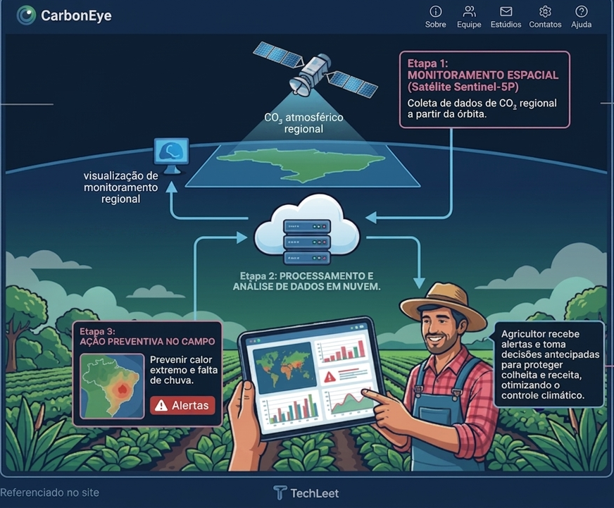

# Site HTML - Global Solution 2026

---

## Projeto

### CarbonEye

Apresemntamos a ideia CarbonEye, onde visamos mapear os níveis de dióxido de carbono (CO₂) com base de dados oferecida pelo satélite Sentinel-5P. Essa tecnologia funicona como um radar que faz uma varredura da qualidade do ar, afim de essas informações sejam oferecidas aos agricultores rurais, para uma maior eficiencia de sua plantação de acordo com a previsão da qualidade do ar no ambiente.

---

## Tecnologias Utilizadas

- HTML
- CSS
- JavaScript

---

## Estrutura de pastas do projeto

Dividimos os arquivos em pastas, os arquivos de CSS estão todos na pasta /css; os de JS estão em /js; e as imagens e icones se encontram em /assets.

---

## Autores e Créditos

Diogo Pedroso Alves
1TDSR
RM: 570024
[GitHub](https://github.com/DiogoPedrosoAlves)
[Linkedin](https://www.linkedin.com/in/diogo-pedroso-alves-895346237/)

Samuel Pedroso Xavier
1TDSR
RM: 569335
[GitHub](https://github.com/OSamuelXavierDev)
[Linkedin](https://www.linkedin.com/in/samuel-xavier-061434274)

Felipe Ferreira Amado
1TDSR
RM: 572567
[GitHub](https://github.com/FelipeFerreiraAmado)
[Linkedin](https://www.linkedin.com/in/felipe-amado/)

Murilo Munari Bissiato
1TDSR
RM: 569602
[GitHub](https://github.com/murilomunari)
[Linkedin](https://www.linkedin.com/in/murilomunaribissiato/)

Pedro Henrique Toledo Sampaio
1TDSR
RM: 571707
[GitHub](https://github.com/PedroSampaio20)
[Linkedin](https://www.linkedin.com/in/pedro-sampaio2002/)

---

## Imagens e representação do projeto

---

## Link do repositório e vídeo

[Repositório_GitHub](https://github.com/DiogoPedrosoAlves/GS_TechLeet)
[Vídeo do site](https://youtu.be/e9G-t3uL0dg)

---

## Contato

Meios de comunicação para dúvidas ou suporte:

rm570024@fiap.com.br

rm569335@fiap.com.br

rm572567@fiap.com.br

rm569602@fiap.com.br

rm571707@fiap.com.br

---
